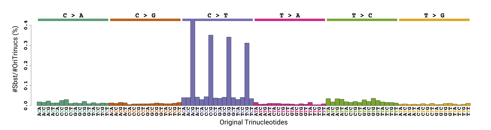
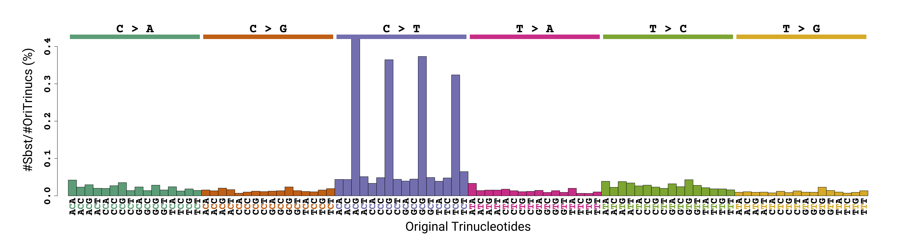
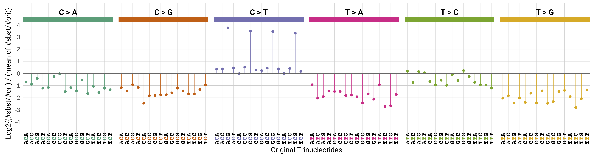
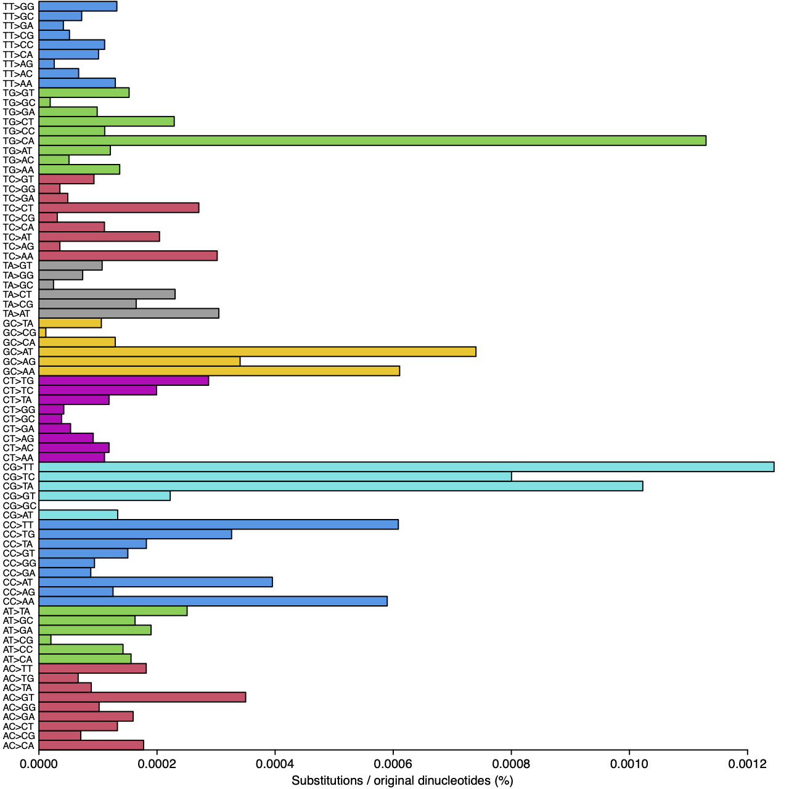
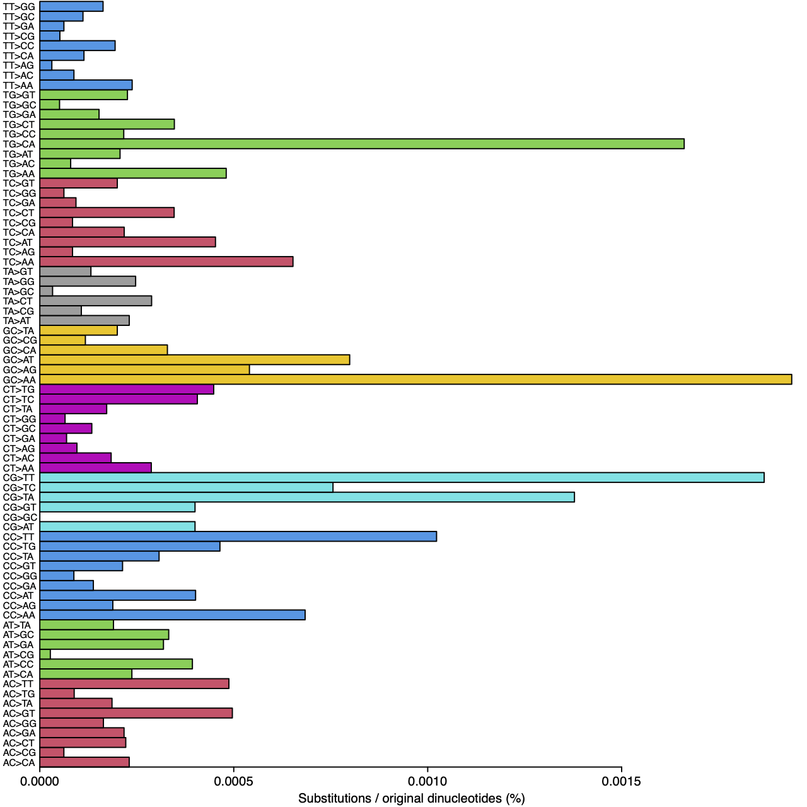

# EvoSubster: Let's investigate evolutionary substitution trends across diverse taxonomic groups ─=≡Σ((( つ•̀ω•́)つ !

## Introduction

EvoSubster analyzes single-base and dinucleotide substitution trends across diverse organisms while accounting for neighboring bases. Provide three closely related genomes (we recommend >80% sequence identity): species A as the outgroup and species B and C as the ingroups. The pipeline downloads their genomic FASTA files and, when available, gene annotations.

Pairwise alignments are generated between _Species A_ vs _Species B_ and _Species A_ vs _Species C_ with LAST, merged into a three-way MAF, and examined under a parsimony model. The downstream Python and R utilities summarize substitution patterns and render publication-ready plots.

## Prerequisites

Install the following command-line tools before running any scripts:

- NCBI Datasets CLI [datasets](https://www.ncbi.nlm.nih.gov/datasets/docs/v2/command-line-tools/download-and-install/) and [jq](https://jqlang.org) for accession metadata
- [LAST](https://gitlab.com/mcfrith/last) for alignment
- [yq](https://github.com/mikefarah/yq) (Mike Farah’s v4+) for reading YAML
- [unzip](https://linux.die.net/man/1/unzip) for extracting NCBI dataset archives
- [python3](https://www.python.org/) (3.8 or later) with the standard library
- [R](https://www.r-project.org/) (≥4.0) with packages: `stringr`, `RColorBrewer`, `showtext`, `jsonlite`, `curl`, `dplyr`, `ggplot2`, `rlang`, `sysfonts`

Make sure the executables are discoverable in your `PATH`. 

## Repository Setup

```bash
git clone https://github.com/marikie/EvoSubster.git
cd EvoSubster
```

Alignment entry points live under `EvoSubster/last/`, analytics helpers under `EvoSubster/analysis/`, and plotting code under `EvoSubster/analysis/R/`.

## Configuration
### `dwl_config.yaml`

Update `EvoSubster/last/dwl_config.yaml` so downloads land in your genome directory:

```yaml
paths:
  # Change the path to the directory to store downloaded genomes
  base_genomes: "/absolute/path/to/genomes"
```
### `sbst_config.yaml`

Adjust `EvoSubster/last/sbst_config.yaml` so results flow to your output directory (the `--out-dir` flag described below can override this per run):

```yaml
paths:
  # Change the path to the directory to store outputs
  out_dir: "/absolute/path/to/outputs"
```

## Running the Pipeline

All commands below should be executed from `EvoSubster/last/`.

### Start from genome downloads

```bash
./trisbst_3spc_fromDwl.sh [DATE] [ORG1_ACCESSION] [ORG2_ACCESSION] [ORG3_ACCESSION] [--out-dir /absolute/path/to/outputs]
```

- `DATE` is any run label (for example `20250131`).
- `ORG1_ACCESSION`, `ORG2_ACCESSION`, `ORG3_ACCESSION` are NCBI genome accession IDs; `ORG1_ACCESSION` should be the outgroup.
- `--out-dir` is optional. When omitted, outputs go under `paths.out_dir` defined in `sbst_config.yaml`.

During execution the wrapper:

- Downloads each accession with the file types listed in `dwl_config.yaml`.
- Unpacks the archives, prunes helper directories, and moves FASTA/GFF assets into the genome directory.
- Detects `genomic.gff` for the outgroup; if missing, downstream steps receive `NO_GFF_FILE`.
- Resolves FASTA paths and invokes `trisbst_3spc.sh` with the appropriate arguments.

### Reuse existing FASTA assets

```bash
./trisbst_3spc.sh [DATE] [ORG1_FASTA] [ORG2_FASTA] [ORG3_FASTA] [ORG1_GFF|NO_GFF_FILE] [--out-dir /absolute/path/to/outputs]
```

- Provide absolute paths to the FASTA files.
- Supply the outgroup GFF path or use `NO_GFF_FILE`.
- `--out-dir` behaves the same as in the download wrapper.

This script:

- Generates short organism identifiers for consistent filenames.
- Computes GC content for ingroup genomes.
- Runs `last_train.sh` on every pair of the three species to calculate their substitution percent identity.
- Produces paired `one2one` alignments for `org1` vs `org2` and `org1` vs `org3`.
- Joins the MAFs into three-way alignments.
- Calls Python utilities to create TSV summaries.
- Uses the outgroup GFF, when available, to cut off the CDS regions.
- Invokes `generate_graphs.sh` to render R visualizations.

## Outputs

Results reside under:

```
<out_dir>/<ORG1short>_<ORG2short>_<ORG3short>/<DATE>/
```

Representative outputs include:

- `*.train`: substitution percent identity estimates from `LAST` (see [last-train](https://gitlab.com/mcfrith/last/-/blob/main/doc/last-train.rst?ref_type=heads))
- `*_gcContent_*.out`: whole-genome GC content for each ingroup FASTA
- `*_sbstRatio*.out`: single-base substitution percentages without considering neighboring bases (see `EvoSubster/analysis/subRatio.py`)
- `*_maflinked.tsv`: single-base substitution counts with maf-link filtering, removing alignments between non-homologous insertions of homologous transposons (see [maf-linked](https://gitlab.com/mcfrith/last/-/blob/main/doc/maf-linked.rst?ref_type=heads))
- `*_maflinked_dinuc.tsv`: dinucleotide substitution counts
- `*_maflinked_sbst.pdf`: bar chart of single-base substitution counts
- `*_maflinked_ori.pdf`: bar chart of original trinucleotide counts
- `*_maflinked_norm.pdf`: single-base substitutions normalized by original trinucleotide counts
- `*_maflinked_logRatio.pdf`: log₂ enrichment of substitution rates relative to the overall mean across substitution types
- `*_maflinked_dinuc*.pdf`: normalized dinucleotide substitution counts
- `*_ncds*`: files derived from non-coding regions when a GFF is available

Re-running the pipeline skips steps whose outputs already exist.

## Example
The figures below are the outputs of a fish trio run. The organisms are:
- *Archocentrus centrarchus* (GCF_007364275.1) — outgroup
- *Amphilophus citrinellus* (GCA_013435755.1) — ingroup
- *Amphilophus zaliosus* (GCA_015108585.1) — ingroup

These three fish are types of Central American cichlids, a group of freshwater fish known for being intelligent, territorial, and very protective of their young.

*Archocentrus centrarchus* is the smallest and most adaptable of the trio. It lives in shallow, plant-filled waters and had a modest, striped appearance. It is generally calmer and suited to sheltered environments.

*Amphilophus citrinellus* is much larger and bolder. It lives mainly in large lakes and connected rivers. It is famous for its bright orange or white coloring and strong personality. This fish is very aggressive and likes to dominate its territory.

*Amphilophus zaliosus* is slimmer and faster. It lives only in Lake Apoyo in Nicaragua and prefers open water rather than the shoreline. It hunts other small fish and has a sleek, arrow-shaped body that helps it swim quickly.

Together, these species show how fish from the same family can evolve to look and behave very differently depending on where and how they live — from quiet shallow waters to powerful lake predators.

Single-base substitution spectrum for *Amphilophus citrinellus*:


Single-base substitution spectrum for *Amphilophus zaliosus*:


Log-scaled single-base substitution spectrum for *Amphilophus citrinellus*:


Log-scaled single-base substitution spectrum for *Amphilophus zaliosus*:


Dinucleotide substitution spectrum for *Amphilophus citrinellus*:


Dinucleotide substitution spectrum for *Amphilophus zaliosus* :
