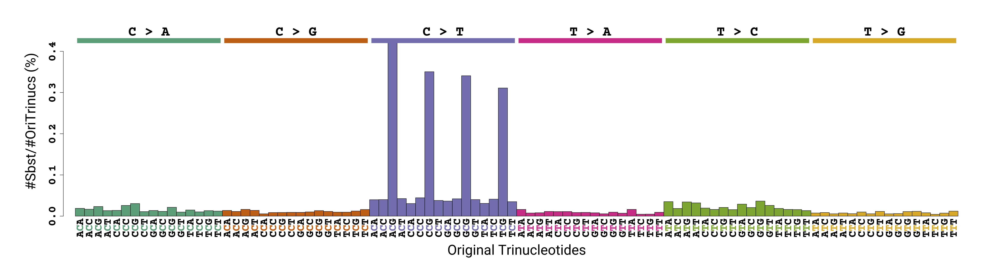
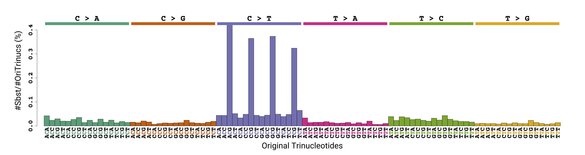
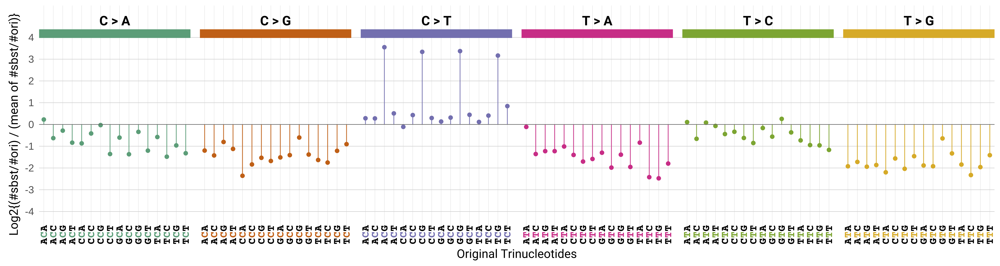
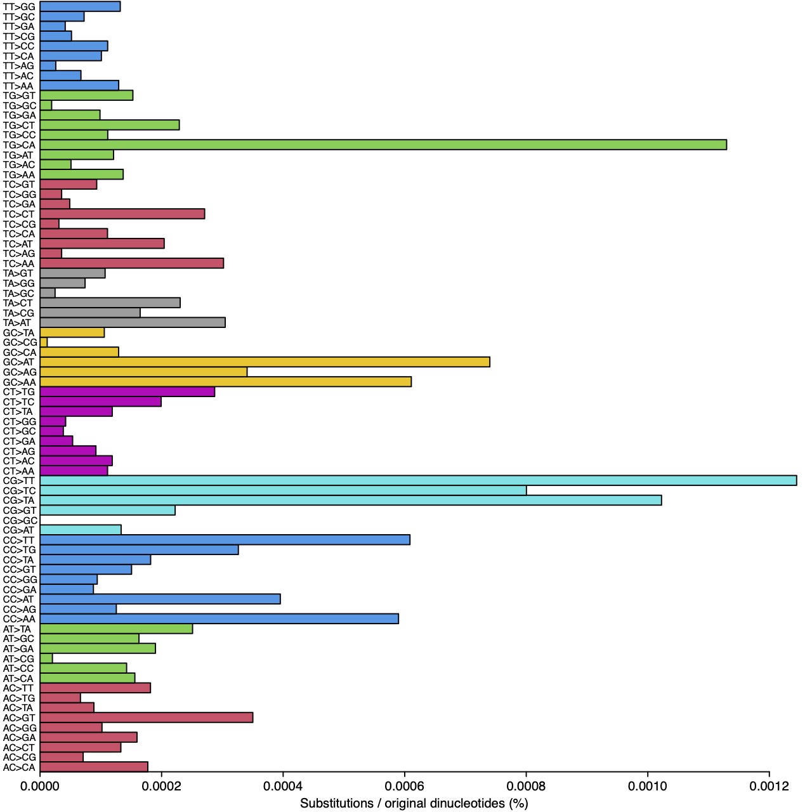
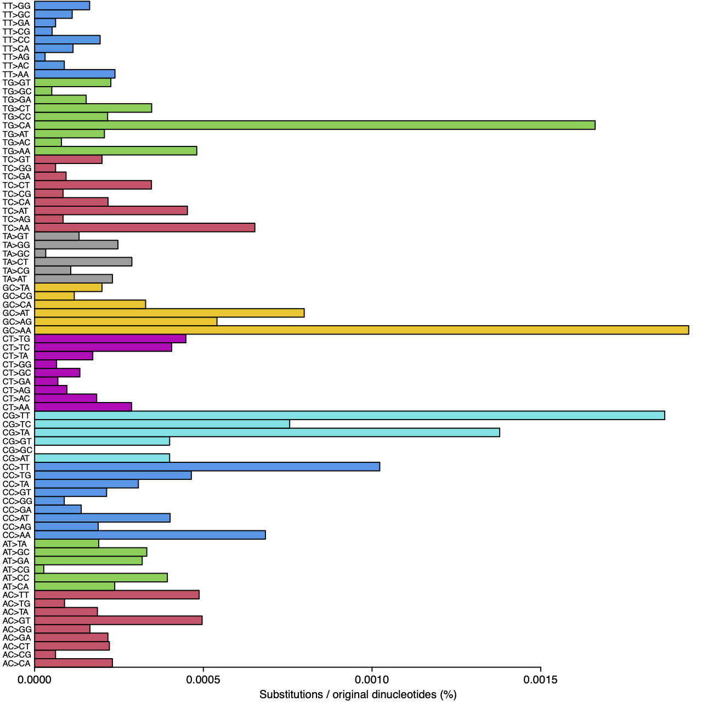

# EvoSubster: Let's investigate evolutionary substitution trends across diverse taxonomic groups ─=≡Σ((( つ•̀ω•́)つ !

## Introduction

EvoSubster analyzes single-base and dinucleotide substitution trends across diverse organisms while accounting for neighboring bases. Provide three closely related genomes (we recommend >80% sequence identity): species A as the outgroup and species B and C as the ingroups. The pipeline downloads their genomic FASTA files and, when available, gene annotations.

Pairwise alignments are generated between _Species A_ vs _Species B_ and _Species A_ vs _Species C_ with LAST, merged into a three-way MAF, and examined under a parsimony model. The downstream Python and R utilities summarize substitution patterns and render publication-ready plots.

Single-base substitution rates are computed in trinucleotide context, requiring that the two flanking bases are conserved across all three genomes while only the central base changes. Double-base substitutions are analyzed in tetranucleotide context, requiring that the two outer bases are conserved while both inner bases change.

## Prerequisites

Install the following command-line tools before running any scripts:

- NCBI Datasets CLI [datasets](https://www.ncbi.nlm.nih.gov/datasets/docs/v2/command-line-tools/download-and-install/) and [jq](https://jqlang.org) for accession metadata
- [LAST](https://gitlab.com/mcfrith/last) for alignment
- [yq](https://github.com/mikefarah/yq) (Mike Farah’s v4+) for reading YAML
- [unzip](https://linux.die.net/man/1/unzip) for extracting NCBI dataset archives
- [python3](https://www.python.org/) (3.8 or later) with the standard library
- [R](https://www.r-project.org/) (≥4.0) with packages: `stringr`, `RColorBrewer`, `showtext`, `jsonlite`, `curl`, `dplyr`, `ggplot2`, `rlang`, `sysfonts`

Make sure the executables are discoverable in your `PATH`.

## Repository Setup

```bash
git clone https://github.com/marikie/EvoSubster.git
cd EvoSubster
```

All commands below are run from the repository root. Pipeline entry points live under `src/`, alignment helpers under `src/align/`, counting scripts under `src/count/`, and R visualizations under `src/visualize/`.

## Running the Pipeline

### Start from genome downloads

```bash
./src/sbst_fromDwl.sh <DATE> <ORG1_ACCESSION> <ORG2_ACCESSION> <ORG3_ACCESSION> [--genomes-dir PATH] [--out-dir PATH] [--thread N] [--idt-only]
```

- `DATE` is any run label (for example `20250131`).
- `ORG1_ACCESSION`, `ORG2_ACCESSION`, `ORG3_ACCESSION` are NCBI genome accession IDs; `ORG1_ACCESSION` should be the outgroup.
- `--genomes-dir` overrides the genome download directory (default: `./genomes`).
- `--out-dir` overrides the output directory (default: `./results`).
- `--thread N` sets the number of alignment threads (default: 8).
- `--idt-only` runs only the `last-train` identity checks and exits.
- `--force` re-downloads all three genomes even if local files already exist.

During execution the wrapper:

- Downloads each accession via `datasets` (includes: `genome`, `gff3`, `rna`, `cds`, `protein`, `seq-report`). If a genomic FASTA is already present and passes a basic validity check (non-empty, starts with `>`), the download is skipped. If the file fails validation (e.g. truncated from a previous interrupted download), it is re-downloaded automatically. Pass `--force` to bypass the check and re-download unconditionally.
- Unpacks the archives, prunes helper directories, and moves FASTA/GFF assets into the genome directory.
- Detects `genomic.gff` for the outgroup; if missing, downstream steps receive `NO_GFF_FILE`.
- Resolves FASTA paths and invokes `sbst.sh` with the appropriate arguments.

### Use FASTA files of your choice

```bash
./src/sbst.sh <DATE> <ORG1_FASTA> <ORG2_FASTA> <ORG3_FASTA> <ORG1_GFF|NO_GFF_FILE> [--out-dir PATH] [--thread N] [--idt-only]
```

- Provide paths to the FASTA files.
- Supply the outgroup GFF path or use `NO_GFF_FILE`.
- `--out-dir`, `--thread`, and `--idt-only` behave the same as in the download wrapper.

This script:

- Computes GC content for all three genomes.
- Runs `last_train.sh` on every pair of the three species to calculate their substitution percent identity.
- Produces paired `one2one` alignments for `org1` vs `org2` and `org1` vs `org3`.
- Joins the MAFs into a three-way alignment.
- Calls Python utilities to count DNA-base substitutions and create TSV summaries.
- Uses the outgroup GFF, when available, to cut CDS regions, count DNA-base substitutions and generate non-coding TSV summaries.
- Invokes `generate_graphs.sh` to render R visualizations.

## Outputs

Results reside under:

```
<out_dir>/<ORG1>_<ORG2>_<ORG3>/<DATE>/
├── intermediateFiles/       # MAF and LAST training files
├── figs/
│   ├── <ORG2>/singlenuc/{ratio,log-ratio,count}/
│   ├── <ORG2>/dinuc/
│   ├── <ORG3>/singlenuc/{ratio,log-ratio,count}/
│   └── <ORG3>/dinuc/
└── statistics/
    ├── <ORG2>/{singlenuc,dinuc}/
    ├── <ORG3>/{singlenuc,dinuc}/
    └── misc/
```

Representative outputs include:

**`intermediateFiles/`**
- `*.train`: substitution percent identity estimates from `LAST` (see [last-train](https://gitlab.com/mcfrith/last/-/blob/main/doc/last-train.rst?ref_type=heads))

**`statistics/misc/`**
- `*_gcContent_*.out`: whole-genome GC content for each FASTA
- `*_sbstRatio*.out`: single-base substitution percentages without considering neighboring bases (see `src/metrics/subRatio.py`)

**`statistics/<ORG>/singlenuc/`**
- `*.tsv`: single-base substitution counts
- `*_ncds.tsv`: non-coding-region variant of the above (only when a GFF is provided)

**`statistics/<ORG>/dinuc/`**
- `*_dinuc.tsv`: dinucleotide substitution counts
- `*_dinuc_ncds.tsv`: non-coding-region variant of the above (only when a GFF is provided)

**`figs/<ORG>/singlenuc/ratio/`** and **`figs/<ORG>/singlenuc/log-ratio/`**
- `*_norm.pdf`: single-base substitutions normalized by original trinucleotide counts
- `*_logRatio.pdf`: log₂ enrichment of substitution rates relative to the overall mean of the substitution rates across all substitution types

**`figs/<ORG>/dinuc/`**
- `*_dinuc*.pdf`: normalized dinucleotide substitution counts by original tetranucleotide counts

Re-running the pipeline skips steps whose outputs already exist.

## Example

The figures below are the outputs of a fish trio run. The organisms are:

- _Archocentrus centrarchus_ (GCF_007364275.1) — outgroup
- _Amphilophus citrinellus_ (GCA_013435755.1) — ingroup
- _Amphilophus zaliosus_ (GCA_015108585.1) — ingroup

These three fish are types of Central American cichlids, a group of freshwater fish known for being intelligent, territorial, and very protective of their young.

_Archocentrus centrarchus_ is the smallest and most adaptable of the trio. It lives in shallow, plant-filled waters and had a modest, striped appearance. It is generally calmer and suited to sheltered environments.

_Amphilophus citrinellus_ is much larger and bolder. It lives mainly in large lakes and connected rivers. It is famous for its bright orange or white coloring and strong personality. This fish is very aggressive and likes to dominate its territory.

_Amphilophus zaliosus_ is slimmer and faster. It lives only in Lake Apoyo in Nicaragua and prefers open water rather than the shoreline. It hunts other small fish and has a sleek, arrow-shaped body that helps it swim quickly.

Together, these species show how fish from the same family can evolve to look and behave very differently depending on where and how they live — from quiet shallow waters to powerful lake predators.

Single-base substitution spectrum for _Amphilophus citrinellus_:


Single-base substitution spectrum for _Amphilophus zaliosus_:


Log-scaled single-base substitution spectrum for _Amphilophus citrinellus_:


Log-scaled single-base substitution spectrum for _Amphilophus zaliosus_:


Dinucleotide substitution spectrum for _Amphilophus citrinellus_:


Dinucleotide substitution spectrum for _Amphilophus zaliosus_ :

