# Let's investigate evolutionary substitution trends across diverse taxonomic groups ─=≡Σ((( つ•̀ω•́)つ !

## Introduction

EvoSubster analyzes single-base and dinucleotide substitution trends across diverse organisms while accounting for neighboring bases. Provide three closely related genomes (we recommend >80% sequence identity): species A as the outgroup and species B and C as the ingroups. The pipeline downloads their genomic FASTA files and, when available, gene annotations.

Pairwise alignments are generated between _Species A_ vs _Species B_ and _Species A_ vs _Species C_ with LAST, merged into a three-way alignment, and examined under a parsimony model. The downstream Python and R utilities summarize substitution patterns and render publication-ready plots.

Single-base substitution rates are computed in trinucleotide context, requiring that the two flanking bases are conserved across all three genomes while only the central base changes. Double-base substitutions are analyzed in tetranucleotide context, requiring that the two outer bases are conserved while both inner bases change.

## Prerequisites

Install the following command-line tools before running any scripts:

- [jq](https://jqlang.org) for JSON parsing
- `curl` for downloading genomes from NCBI Datasets API
- [LAST](https://gitlab.com/mcfrith/last) for alignment
- [yq](https://github.com/mikefarah/yq) (Mike Farah’s v4+) for reading YAML
- [unzip](https://linux.die.net/man/1/unzip) for extracting downloaded archives
- [python3](https://www.python.org/) (3.8 or later) with the standard library
- [R](https://www.r-project.org/) (≥4.0) with packages: `stringr`, `RColorBrewer`, `showtext`, `jsonlite`, `curl`, `dplyr`, `ggplot2`, `rlang`, `sysfonts`

Make sure the executables are discoverable in your `PATH`.

## Repository Setup

```bash
git clone https://github.com/marikie/EvoSubster.git
cd EvoSubster
```

All commands below are run from the repository root. Pipeline entry points live under `src/`, alignment helpers under `src/align/`, counting scripts under `src/count/`, and R visualizations under `src/visualize/`.

## Running the Pipeline

### Start from genome downloads

```bash
./src/sbst_fromDwl.sh <DATE> <ORG1_ACCESSION> <ORG2_ACCESSION> <ORG3_ACCESSION> [--genome-dir PATH] [--out-dir PATH] [--thread N] [--idt-only]
```

- `DATE` is any run label (for example `20250131`).
- `ORG1_ACCESSION`, `ORG2_ACCESSION`, `ORG3_ACCESSION` are NCBI genome accession IDs; `ORG1_ACCESSION` should be the outgroup.
- `--genome-dir` overrides the genome download directory (default: `./genomes`).
- `--out-dir` overrides the output directory (default: `./results`).
- `--thread N` sets the number of alignment threads (default: 8).
- `--idt-only` runs only the `last-train` identity checks and exits.
- `--force` re-downloads all three genomes even if local files already exist.

During execution the wrapper:

- Downloads each accession via `datasets` (includes: `genome`, `gff3`, `rna`, `cds`, `protein`, `seq-report`). If a genomic FASTA is already present and passes a basic validity check (non-empty, starts with `>`), the download is skipped. If the file fails validation (e.g. truncated from a previous interrupted download), it is re-downloaded automatically. Pass `--force` to bypass the check and re-download unconditionally.
- Unpacks the archives, prunes helper directories, and moves FASTA/GFF assets into the genome directory.
- Detects `genomic.gff` for the outgroup; if missing, downstream steps receive `NO_GFF_FILE`.
- Resolves FASTA paths and invokes `sbst.sh` with the appropriate arguments.

### Select trios from a Newick tree

```bash
./src/sbst_fromDwl.sh --tree <FILE.nwk> [DATE] [--genome-dir PATH] [--out-dir PATH] [--train-cache-dir PATH] [--keep-unused-species-data] [--stage0-top-k N] [--assembly-qc FILE] [--allow-qc-override]
```

Tree mode selects assemblies and candidate outgroups, downloads genomes and
builds `last-train` caches on demand, then runs the pipeline for each selected
trio. After `selected_trios.tsv` is finalized, it removes only genome artifacts,
train files, and LAST database directories that were created by the current
selection run and belong to accessions absent from every selected trio.
Pre-existing data, selected-accession data, and
selection audit tables are retained. Cleanup decisions are recorded in
`<out-dir>/trio_selection/cleanup_unused_species.tsv`.

Use `--keep-unused-species-data` to disable current-run artifact tracking and
cleanup for debugging. Cleanup is enabled by default in both direct
`trio_selection.R` runs and wrapper tree mode. Any unsafe path or incomplete
deletion makes trio selection fail before downstream `sbst.sh` runs begin.

Tree leaves must contain accession-free complete NCBI taxon names, with spaces
encoded as underscores. Keep subspecies, strain, and informal identifiers; for example,
`Chaunax_sp._Z400` is read as `Chaunax sp. Z400`. A terminal assembly accession
is not accepted by Stage 0.

Convert a legacy tree whose leaves end in a versioned GCA/GCF accession before
running the pipeline:

```bash
python3 src/select/strip_newick_accessions.py \
  --input path/to/legacy-tree.nwk \
  --output path/to/accession-free-tree.nwk
```

The converter removes only a terminal `_GCA_...version` or
`_GCF_...version` suffix from leaf labels. Leaves that are already
accession-free are retained and reported as warnings. Existing output files are
not overwritten unless `--force` is supplied, and the input file itself is
never overwritten.

```bash
./src/sbst_fromDwl.sh \
  --tree path/to/accession-free-tree.nwk \
  20260801 \
  --stage0-top-k 3 \
  --assembly-qc path/to/external_qc.tsv
```

Stage 0 queries each complete leaf taxon with exact NCBI taxon matching, so a
subspecies or strain is not silently merged into its parent species. It
discovers all current non-MAG NCBI assemblies for every taxon on the tree and
records the versioned `GCA_...version` or `GCF_...version` accession.
It then uses a two-phase selection:

1. Exclude non-current, NCBI-atypical, ANI-Failed, unsupported hybrid/alternate
   haplotype/unresolved-diploid, and optional relative-contig-N50 gate failures.
2. Build a per-species shortlist and choose a metadata baseline. The exact
   eukaryote baseline order is: annotated NCBI Reference; unannotated NCBI
   Reference; annotated RefSeq; other annotated; existing metadata fallback.

Prokaryote candidates are ranked by ANI status, CheckM completeness,
CheckM contamination, optional Merqury evidence, assembly level, contig count,
and contig N50. This prokaryote ranking is unchanged. For eukaryotes, comparable
external BUSCO `genome`-mode and optional Merqury results are attached for audit
and review but do not change the metadata baseline by default. NCBI annotation
BUSCO values are retained for audit but are not treated as assembly-level BUSCO
genome-mode measurements.

Pass `--allow-qc-override` only when an automatic replacement is intended. An
override requires complete BUSCO components for both distinct assemblies from
the same genome mode, lineage, and BUSCO version. The alternative must have
higher Single-copy BUSCO and no worse Duplicated, Fragmented, or Missing BUSCO.
Annotation is not required for the alternative. Merqury remains audit-only for
this decision. A BUSCO override measures gene-content completeness under that
BUSCO run; it does not establish base-level consensus accuracy or Merqury QV.

The optional external QC TSV is keyed by an exact versioned GCA/GCF
`accession`. Unmatched accessions produce a diagnostic; when an explicit
override is requested with no input rows or no row matching the fetched
metadata, Stage 0 stops. Every row must contain BUSCO or Merqury evidence. The
TSV may contain these columns:

```text
accession
qc_busco_mode              # required as "genome" when any BUSCO field is set
qc_busco_lineage
qc_busco_version
qc_busco_complete
qc_busco_single
qc_busco_duplicated
qc_busco_fragmented
qc_busco_missing
qc_busco_internal_stop
merqury_qv
merqury_completeness
```

Merqury-only rows may leave `qc_busco_mode` empty. All BUSCO percentage
components must be in `[0, 100]`. Complete must equal
Single-copy plus Duplicated within 0.2 percentage points, and Complete plus
Fragmented plus Missing must equal 100 within 0.2 percentage points. If
Single-copy is omitted but Complete and Duplicated are present, it is derived as
their difference. All comparable BUSCO candidates for one species must use the
same lineage and version. Incomplete legacy rows remain auditable but cannot
trigger an override.

NCBI `paired_accession` metadata is used to treat paired GCA/GCF accessions as
one assembly. A paired record cannot create a review or override merely by
appearing under the other accession namespace.

Stage 0 writes the following audit files under
`<out-dir>/trio_selection/`:

- `assembly_metadata.tsv`: raw NCBI candidate metadata.
- `assembly_candidates_audit.tsv`: every candidate plus exclusion reason,
  profile, baseline and final ranks, baseline/QC preferences, review reasons,
  override blocker codes, and selection basis.
- `assembly_shortlist.tsv`: up to `--stage0-top-k` candidates per species.
- `assembly_review.tsv`: every candidate for species requiring QC review; this
  file always contains headers, including when no species requires review.
- `selected_assemblies.tsv`: the one assembly passed to Stage 1 for each species.

### Use FASTA files of your choice

```bash
./src/sbst.sh <DATE> <ORG1_FASTA> <ORG2_FASTA> <ORG3_FASTA> <ORG1_GFF|NO_GFF_FILE> [--out-dir PATH] [--train-cache-dir PATH] [--accession-ids ACC1 ACC2 ACC3] [--thread N] [--idt-only]
```

- Provide paths to the FASTA files.
- When reusing `last-train` cache files with custom FASTA names, provide the
  exact versioned NCBI accessions through `--accession-ids`; otherwise cache
  reuse is enabled only when all three filenames begin with a versioned
  `GCA_...` or `GCF_...` accession.
- Supply the outgroup GFF path or use `NO_GFF_FILE`.
- `--out-dir`, `--thread`, and `--idt-only` behave the same as in the download wrapper.

This script:

- Computes GC content for all three genomes.
- Runs `last_train.sh` on every pair of the three species to calculate their substitution percent identity.
- Produces paired `one2one` alignments for `org1` vs `org2` and `org1` vs `org3`.
- Joins the MAFs into a three-way alignment.
- Calls Python utilities to count DNA-base substitutions and create TSV summaries.
- Uses the outgroup GFF, when available, to cut CDS regions, count DNA-base substitutions and generate non-coding TSV summaries.
- Invokes `generate_graphs.sh` to render R visualizations.

## Outputs

Results reside under:

```
<out_dir>/<ORG1>_<ORG2>_<ORG3>/<DATE>/
├── intermediateFiles/       # MAF and LAST training files
├── figs/
│   ├── <ORG2>/singlenuc/{ratio,log-ratio,count}/
│   ├── <ORG2>/dinuc/
│   ├── <ORG3>/singlenuc/{ratio,log-ratio,count}/
│   └── <ORG3>/dinuc/
└── statistics/
    ├── <ORG2>/{singlenuc,dinuc}/
    ├── <ORG3>/{singlenuc,dinuc}/
    └── misc/
```

Representative outputs include:

**`intermediateFiles/`**

- `*.train`: substitution percent identity estimates from `LAST` (see [last-train](https://gitlab.com/mcfrith/last/-/blob/main/doc/last-train.rst?ref_type=heads))

**`statistics/misc/`**

- `*_gcContent_*.out`: whole-genome GC content for each FASTA
- `*_sbstRatio*.out`: single-base substitution percentages without considering neighboring bases (see `src/metrics/subRatio.py`)

**`statistics/<ORG>/singlenuc/`**

- `*.tsv`: single-base substitution counts
- `*_ncds.tsv`: non-coding-region variant of the above (only when a GFF is provided)

**`statistics/<ORG>/dinuc/`**

- `*_dinuc.tsv`: dinucleotide substitution counts
- `*_dinuc_ncds.tsv`: non-coding-region variant of the above (only when a GFF is provided)

**`figs/<ORG>/singlenuc/ratio/`** and **`figs/<ORG>/singlenuc/log-ratio/`**

- `*_norm.pdf`: single-base substitutions normalized by original trinucleotide counts
- `*_logRatio.pdf`: log₂ enrichment of substitution rates relative to the overall mean of the substitution rates across all substitution types

**`figs/<ORG>/dinuc/`**

- `*_dinuc*.pdf`: normalized dinucleotide substitution counts by original tetranucleotide counts

Re-running the pipeline skips steps whose outputs already exist.

## Example

The figures below are the outputs of a fish trio run. The organisms are:

- _Archocentrus centrarchus_ (GCF_007364275.1) — outgroup
- _Amphilophus citrinellus_ (GCA_013435755.1) — ingroup
- _Amphilophus zaliosus_ (GCA_015108585.1) — ingroup

These three fish are types of Central American cichlids, a group of freshwater fish known for being intelligent, territorial, and very protective of their young.

_Archocentrus centrarchus_ is the smallest and most adaptable of the trio. It lives in shallow, plant-filled waters and had a modest, striped appearance. It is generally calmer and suited to sheltered environments.

_Amphilophus citrinellus_ is much larger and bolder. It lives mainly in large lakes and connected rivers. It is famous for its bright orange or white coloring and strong personality. This fish is very aggressive and likes to dominate its territory.

_Amphilophus zaliosus_ is slimmer and faster. It lives only in Lake Apoyo in Nicaragua and prefers open water rather than the shoreline. It hunts other small fish and has a sleek, arrow-shaped body that helps it swim quickly.

Together, these species show how fish from the same family can evolve to look and behave very differently depending on where and how they live — from quiet shallow waters to powerful lake predators.

Single-base substitution spectrum for _Amphilophus citrinellus_ (whole genome):
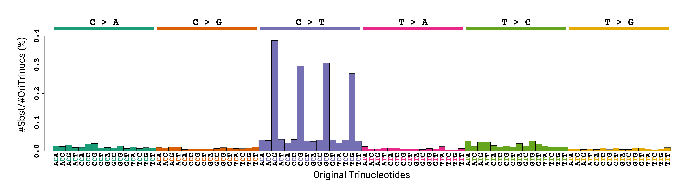

Single-base substitution spectrum for _Amphilophus citrinellus_ (non-coding region):
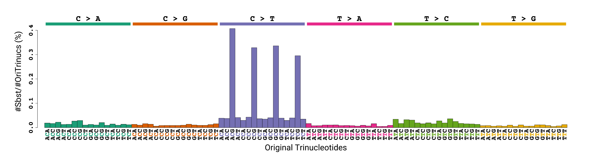

Single-base substitution spectrum for _Amphilophus zaliosus_ (whole genome):
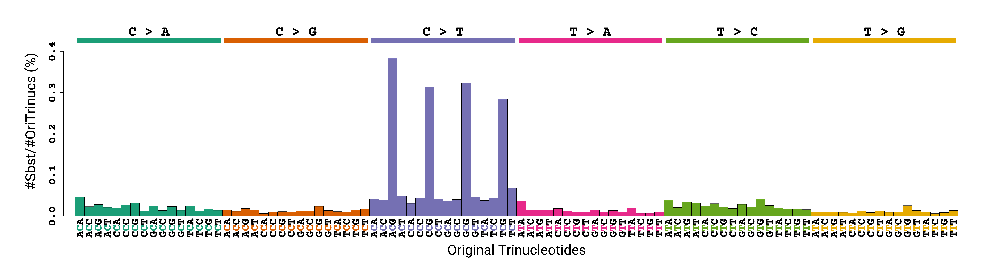

Single-base substitution spectrum for _Amphilophus zaliosus_ (non-coding region):
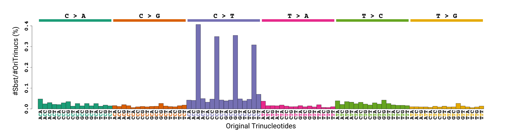

Log-scaled single-base substitution spectrum for _Amphilophus citrinellus_ (whole genome):
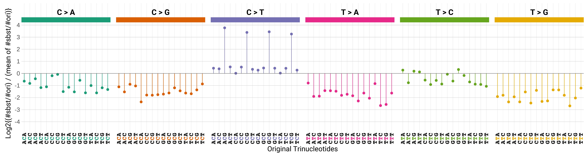

Log-scaled single-base substitution spectrum for _Amphilophus citrinellus_ (non-coding region):
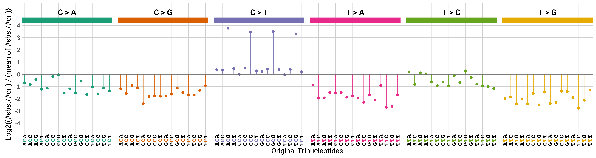

Log-scaled single-base substitution spectrum for _Amphilophus zaliosus_ (whole genome):
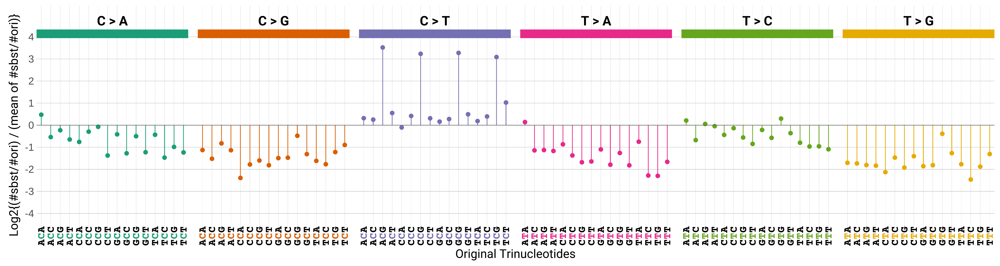

Log-scaled single-base substitution spectrum for _Amphilophus zaliosus_ (non-coding region):
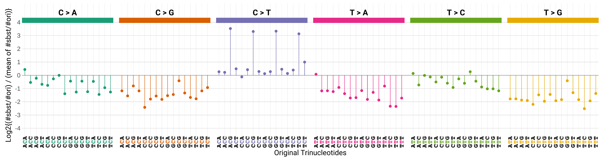

Dinucleotide substitution spectrum for _Amphilophus citrinellus_ (whole genome):
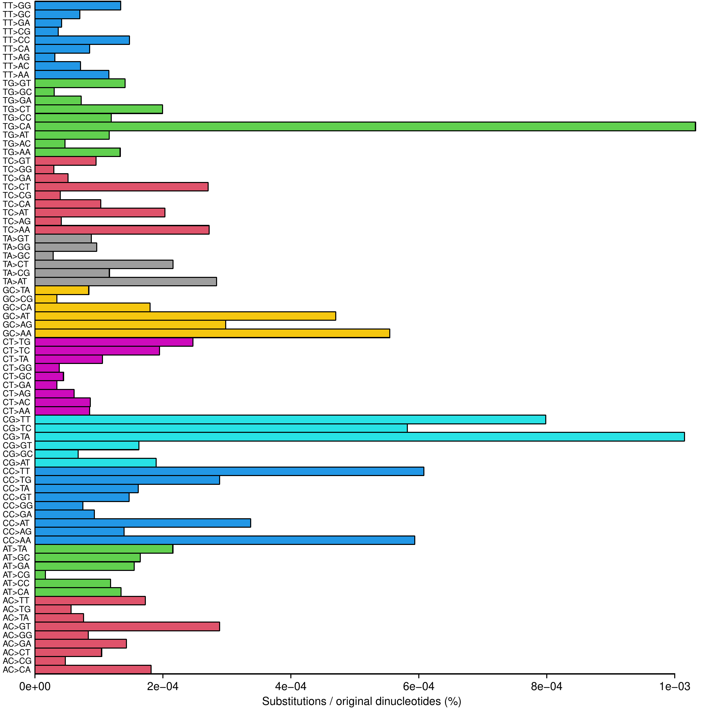

Dinucleotide substitution spectrum for _Amphilophus citrinellus_ (non-coding):
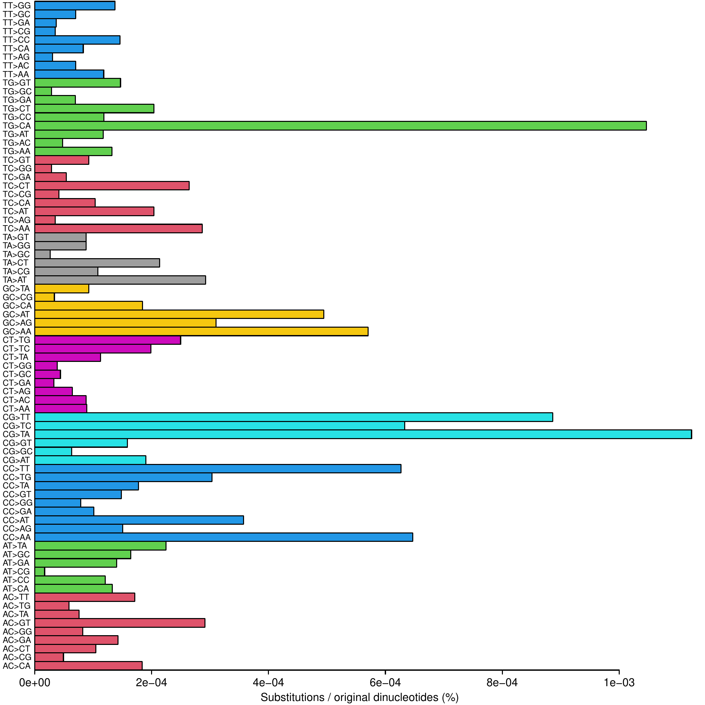

Dinucleotide substitution spectrum for _Amphilophus zaliosus_ (whole genome):
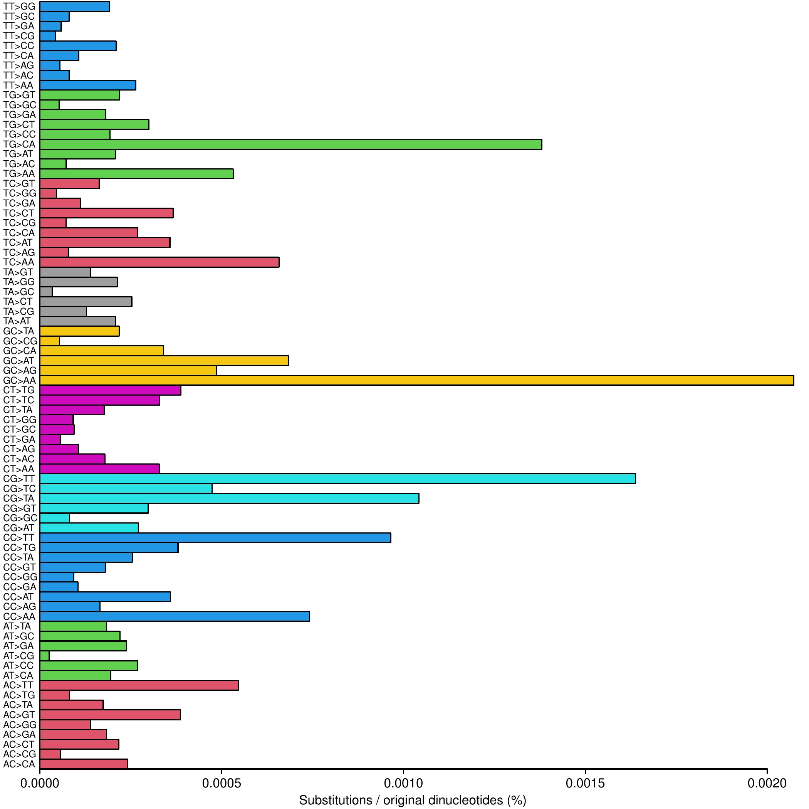

Dinucleotide substitution spectrum for _Amphilophus zaliosus_ (non-coding region):
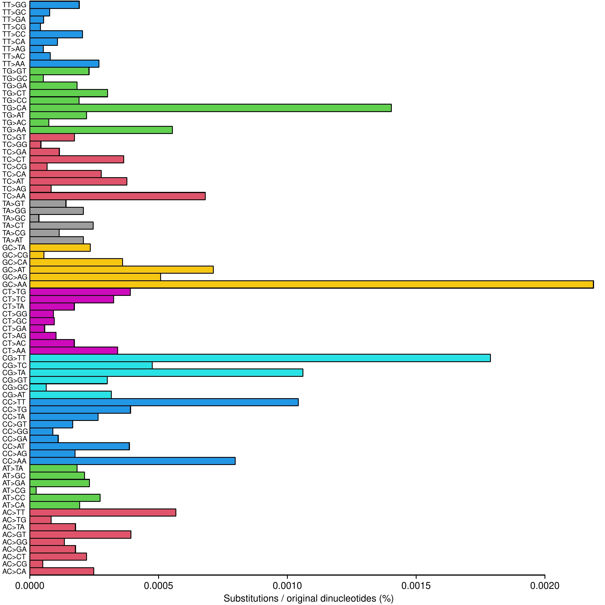
